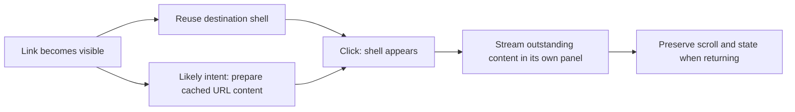

# Public experience integration plan

Date: September 6, 2026
Status: Implementation and final polish verified locally; push to `main` authorized. Production verification remains separate.
Notion: [Public experience plan](https://app.notion.com/p/3d3a881304bb817c8cade59f2451329a).
Source baseline: `655c07e67a2bd6fc1eb2e4e7cb638e26ddaa2b01`.
Scope: all 37 frontend page definitions, their layouts and states, and the component inventory in [Public experience coverage](public-experience-coverage.md).

## Outcome and scope

Make navigation respond immediately, keep reading and browsing context intact, and reduce unnecessary rendering and fetching while preserving Lyóvson.com's crest, typography, equal 3×3 menu, responsive card grid, and light/dark character.

Payload admin is excluded at Rafa's request. Public CMS reads, publication invalidation, media delivery, and the existing frontend preview boundary remain dependencies of the public experience. This plan does not introduce an admin redesign, a new content workflow, new subscriptions, a translation project, a database migration, or a framework upgrade.

This document retains the approved design and acceptance contract. The implementation result below records current local evidence and remaining release checks; the starting-point table describes the original baseline.

## Verified starting point

| Area | Current implementation | Planned treatment |
| --- | --- | --- |
| Frameworks | Next.js 16.3.4, React/React DOM 19.2.8, Payload packages 3.88.0 | Keep these versions during the initial integration so behavior changes can be attributed. |
| Cached rendering | `cacheComponents: true`, named `cacheLife` profiles, many `use cache` helpers | Improve cache ownership and coverage; do not re-enable an already enabled feature. |
| Navigation | `AppLink` defaults to automatic prefetch; `IntentLink` switches from false to true on hover/focus/touch | Add inexpensive shell preparation before intent, preserving deliberate URL-specific prefetch. |
| Partial Prefetching | No global flag or route opt-in in the current frontend | Adopt at public route segments; leave the global flag off while admin is excluded. |
| React optimization | `reactCompiler: true`; cached navigation and new scroll-handler flags enabled | Preserve, measure, and avoid a separate hand-written page cache. |
| View transitions | Shared image/title/card identities, pagination types, loading fades, anchored panels | Preserve the completed work and its later snapshot-stacking and crossfade fixes. |
| Search | Submit-only hybrid search; transition-aware input; global and author-scoped results | Keep typing free of embedding requests; improve shell and result behavior. |
| Recovery | Route retry and `catchError` for optional panels already exist | Expand isolation only where an independent failure would otherwise obscure useful content. |
| Media | Responsive image sizes, YouTube click-to-load, lazy GIF videos, server-rendered X embeds | Fix remaining hydration and hidden-media work; retain existing optimizations. |

Evidence: `next.config.ts`, `package.json`, `src/components/AppLink.tsx`, `src/components/IntentLink.tsx`, `src/search`, and `docs/view-transition-audit.md`.

The existing [transition task](https://app.notion.com/p/3d2a881304bb816699d0e91f7aa77fcb) records subsequent released fixes beyond the older local-only wording in the repository audit. Its recorded image-handoff, shared-fade dimming, and pagination-number fixes are regression requirements here. The task also records legacy direct-media failures with working displayed Blob images; this plan does not assume those historical failures are still live.

## Rendering and navigation contract

Keep three mechanisms distinct:

- **Cache Components:** reuse public data or rendered output with explicit keys, tags, and freshness.
- **Partial prerendering:** deliver useful initial HTML and independently stream work that cannot be ready yet.
- **Partial Prefetching and Instant Navigation:** prepare a reusable route shell before navigation and optionally resolve cached URL-specific content ahead of a likely click.

A cached query alone does not prove a route has a useful instant shell. A skeleton alone does not prove the article is ready. Test both initial response and eventual complete content. See the [instant-navigation guide](https://nextjs.org/docs/app/guides/instant-navigation).

### Cache layers and shell eligibility

Distinguish the generated HTML/RSC shell and its CDN/ISR storage, `use cache` function output, the browser router/Activity cache, and browser/image asset caches. A hit in one does not prove a hit in the others. The current app configures no custom cache handler: default runtime `use cache` storage is in-memory, so reuse between serverless instances or shell revalidations is not guaranteed, and entries do not survive a new deployment. Measure cold/warm public requests on the actual host before promising lower Neon usage. Remote caching is a later decision only if repeated expensive misses justify its cost. [Cache runtime behavior](https://nextjs.org/docs/app/api-reference/directives/use-cache).

Check effective nested cache lifetimes when choosing shell content. In the installed version, `revalidate: 0` or `expire < 300` excludes a cache from prerendering; `stale < 30` also excludes it, and `30 ≤ stale < 300` allows prerendering but excludes it from the App Shell. Existing long-lived public profiles are candidates, not proof of readiness. Do not lengthen private or rapidly changing data lifetimes just to make a shell eligible. [Cache lifetime reference](https://nextjs.org/docs/app/api-reference/functions/cacheLife).

### Public route adoption

Use the supported `export const prefetch = 'partial'` on destination pages/layouts. Begin with a small set of routes, then expand to all in-scope public destinations. Consider consolidating at the frontend layout only after all descendants and the protected playground are understood. Do not enable global `partialPrefetching` as part of this public-only plan.

Place Suspense around URL-dependent work **below each layout shared with the source route**. Audit `params`, `searchParams`, and awaited profile/entity lookups even when `generateStaticParams` exists. In particular, a loading boundary beneath `[lyovson]/layout.tsx` cannot cover work that the author layout itself awaits. Give the author profile slot and child page suitable boundaries and verify entering an author, switching authors, and switching sections within the same author.

Preserve semantic DOM and grid placement: additional wrappers must not change grid children, article landmarks, profile placement, or screen-reader order. Prefer component boundaries/fragments that do not introduce layout boxes.

Check the shared navigation on a fresh load before changing route boundaries. The root layout currently suspends the entire `GridCardNav` behind `SkeletonCard`, and the navigation reads URL state. Inspect the actual prerendered HTML: if stable branding and ordinary links disappear until hydration, separate those from the smallest URL-dependent controls. The menu's equal 3×3 layout must remain intact; a generic navigation skeleton is not a useful completed shell.

Treat `instant` as validation, not an accelerator. Resolve development insights and use automated tests for release gates; a production build does not enforce all instant-navigation expectations. Do not silence public warnings with blanket `instant = false`. [Route prefetch reference](https://nextjs.org/docs/app/api-reference/file-conventions/route-segment-config/prefetch), [instant reference](https://nextjs.org/docs/app/api-reference/file-conventions/route-segment-config/instant).

### Link policy

| Destination or interaction | Before a click | On intent / click | Acceptance |
| --- | --- | --- | --- |
| Main menu, home, static pages | Automatic reusable-shell prefetch | Navigate without waiting for decoration | Ready shell, usable keyboard focus, correct active context. |
| Post/note/activity/project detail | Automatic shell prefetch after destination adoption | Resolve cached URL-specific content on hover/focus/touch; do not rely on touch alone for readiness | Warm hero can share its image/title; cold path immediately shows a shaped fallback. |
| Pagination | Automatic shell; prioritize next/previous only if measurements justify wider prefetch | Preserve directional types and canonical page-one link | No bulk prefetch of every numbered page's full results. |
| Topic/author links, metadata pills, related items | Shell by default; selective intent prefetch | Match author/topic identity and scope | Dense repeated links reuse work; no request explosion. |
| Search input and arbitrary query links | Prepare search shell only | Execute only on explicit query navigation | Zero embedding calls from typing, hover, or route-shell prefetch. |
| External, mailto, file/download, preview and protected utility destinations | No internal data prefetch | Preserve native behavior/authentication | No speculative mutation or protected-data retrieval. |

Treat form submission, a bookmarked `/search?q=...`, and refresh of that URL as explicit query navigation. Typing, link hover and shell prefetch must not execute embeddings. Deduplicate matching work within one render request; do not promise globally exactly-once execution across refreshes, provider retries or separate tabs. Pending results must be visibly identified and never presented as the new query's completed results.

Keep native modifier-click/new-tab, middle-click, download and hash-link behavior. Give delayed navigation/search meaningful pending feedback without flashing a loader on already-ready clicks. Verify focus placement, `aria-current`, result-region busy state and completion announcements; a hidden text label alone is not proof that updates are announced.

Update `IntentLink` and audit every `prefetch={true/false/null}`, `AppLink`, `CMSLink`, `PostDrillInLink`, and imperative `router.push` caller. A shared wrapper change must not silently change unadopted routes. Track each destination's readiness; widen the wrapper only after its callers are ready.

Partial Prefetching changes the meaning of `prefetch={true}`: URL-specific cached content can be prepared, while uncached work still streams. Do not promise full rich-text/third-party completion because the link was hovered. [Adoption guide](https://nextjs.org/docs/app/guides/adopting-partial-prefetching), [prefetch optimization](https://nextjs.org/docs/app/guides/optimizing-prefetching).

## Cache ownership and public data

Keep cache ownership in the existing domain helpers. Cache rendered subtrees only when this removes measured repeated rendering or gives the shell meaningful content; avoid duplicating caches at page, query, and presentational component layers without a reason. Pure cards, icons, and buttons do not each need `use cache`.

| Data family | Files / owner | Required work and invalidation contract |
| --- | --- | --- |
| Posts and archives | `get-post.ts`, `post-summary.ts`, post hooks | Retain lean archive selection and full detail content. Keys cover slug/page/limit. Keep collection + slug invalidation, old/new slug handling, counts and archive coverage. |
| Notes and activities | `get-note.ts`, `get-activity.ts`, their hooks | Introduce summary projections only after enumerating fields used by excerpt, quote, author, review and reference cards. Preserve activity date+slug identity and visibility predicates. |
| Author profile and mixed feeds | `get-lyovson-profile.ts`, `get-lyovson-feed.ts` | Cache only intended public profile fields; verify access semantics. Bound deep-page fetch growth, retain mixed ordering and totals, and use summaries instead of full article bodies. |
| Projects and topics | `get-project*.ts`, `get-topic*.ts` | Remove repeated entity lookup within one render where practical; pass a verified entity ID to child queries. Keep independent work parallel and retain current summaries. |
| Related content | Inline `RelatedPosts` / `RelatedNotes` in detail pages | Move public related-item reads into named cached helpers. Current inline reads are uncached. Apply published/public predicates before caching, preserve exclusions, ordering and deduplication. Related notes currently query IDs without the shared public-note predicate; verify/correct this before widening cache/prefetch. |
| References, media, authors, taxonomies | Collection hooks + populated public content | Map changes in related entities to every cache that embeds their fields. Verify media alt/URL and author name changes propagate through archives and detail pages. |
| Search | `search/service.ts`, `search/page-content.tsx` | Keep the shell independent of search execution. Start with per-request deduplication and existing browser reuse. Shared result caching is optional only after bounding normalized query/author/limit/model keys, TTL, privacy, and invalidation. |
| Feeds, metadata and discovery | `syndication-feed.ts`, sitemap/robots/llms/API docs | Keep metadata and body visibility aligned. Reuse existing public cached data; preserve URLs, feed counts, canonical paths and robots behavior. |

Payload Local API reads bypass access control by default (`overrideAccess: true`). Explicitly define the public access/published predicates and the fields allowed in shared cached output, including populated authors, uploads and references; do not assume a caller's session makes a helper safe. Keep request objects, headers, cookies and preview state outside shared cache scopes. Test runtime-only paths too: an indirect request API read can pass the build and fail when a cached helper runs. [Payload Local API](https://payloadcms.com/docs/local-api/overview).

Use `select`, bounded `depth`/`populate`, and the existing cached Payload instance. Preserve fields added by read hooks. Skip total-count queries only for bounded lookups that do not use totals (`pagination: false` with an explicit `limit`); archive pagination still needs accurate counts. Do not bypass Payload hooks with raw database calls as a performance shortcut. [Payload query performance](https://payloadcms.com/docs/performance/overview).

Do not extend the existing long lifetimes until publication invalidation is proven. Keep current named profiles initially; record `stale`, `revalidate`, and `expire` independently. Preserve immediate expiration for removal/unpublication/old-slug invalidation and the chosen stale-while-revalidate behavior for ordinary edits. Payload hooks are not automatically Server Actions: use the supported `revalidateTag`/path APIs there, not a blind replacement with `updateTag`.

Do not cache transient error UI as successful content. If missing-document results are cached, ensure publishing that slug invalidates the negative result.

Test insert, edit, publish, unpublish, delete, slug/date change, and author/topic/project reassignment. Server cache invalidation does not instantly erase a previously delivered page from an open browser; test fresh requests, navigation, refresh, and Back separately. Never describe cached public browser content as revocable access control.

Preview/authentication reads remain outside shared public cache scope. Preserve existing preview authorization; do not expose drafts to shells or opportunistically add preview functionality. Any fixture that mutates content must use an isolated test database, not the live CMS.

### Static generation and first visitors

Keep the current static-parameter coverage initially. Include at least one valid published fixture omitted from build-time parameters in testing. Next 16.3 can show a shell for such a page and prerender the rest afterward; prove this works with our visibility, metadata, and missing-document paths before considering a smaller build-time set. Newly published pages must appear without a code rebuild.

Do not remove `generateStaticParams` wholesale or assume cached static-parameter lists rerun automatically on publication. Test valid unseen URLs, invalid slugs, empty taxonomies, invalid page numbers, and the page-one redirect. [ISR with Cache Components](https://nextjs.org/docs/app/guides/incremental-static-regeneration-cache-components).

### Metadata and discovery under streaming

Verify title, canonical URL, Open Graph images, robots directives and existing JSON-LD against the same public record as the page body. Exercise HTML-limited crawlers, delayed JavaScript, unpublished and unseen-at-build slugs. Preserve the current search indexing policy and activity date-based canonical paths; metadata must not run semantic search. Test HTTP status, final not-found UI and `noindex` separately: a streamed response may already have sent status 200 when missing content is discovered. Do not assert a universal 404 after streaming begins. [Metadata behavior](https://nextjs.org/docs/app/api-reference/functions/generate-metadata), [not-found behavior](https://nextjs.org/docs/app/api-reference/file-conventions/not-found).

## State, motion and components

### State preservation

Use Next's existing Activity-based preservation rather than adding a second router or global page store. Define what should survive per component:

| State | Preserve | Reset / stop |
| --- | --- | --- |
| Archive and search | Scroll position, URL query/scope/page, useful expanded reading state | A new URL must never display the previous author's/query's results as current. |
| Main navigation | Persistent frame and theme; URL-derived author context | Close transient menus according to existing route rules; retain Escape focus restoration. |
| Article media | Playback position when practical | Pause hidden video/audio and stop hidden iframe playback. Returning must not unexpectedly autoplay audio. |
| Copy and transient controls | Article text and selection when browser behavior allows | Clear stale “Copied”/error/busy indicators; no duplicate timers/listeners. |
| Theme | User/system preference | No hydration flash, no forced remount of the app. |
| Dormant forms/settings | No activation in this project | If later mounted, specify draft vs success-state preservation in that separate feature. |

Audit both frontend templates, keyed transition boundaries, URL-keyed state, and Effect cleanup. Preserve the existing reset semantics deliberately; do not remove every key or place a pathname key above the entire app. History restoration may be immediate without a reverse animation. Next currently retains up to three routes; test a longer journey that evicts the oldest route and verify a clean reconstruction from the URL. Test browser back/forward cache separately from Next's route preservation. Do not promise indefinite retention of playback, text selection or unsaved component state. Correct state/focus/scroll takes precedence. [State preservation guide](https://nextjs.org/docs/app/guides/preserving-ui-state).

### Motion contract

Retain the current motion system: shared geometry 280ms desktop / 220ms small screens, content 180ms, standalone exits 120ms, existing short directional pagination. Paired shared fades retain their corrected balanced timing/blending rather than inheriting the shorter standalone exit.

- Preserve the navigation frame, unchanged author profile, repeated activity rail and pagination frame.
- Share card image/title/metadata only when both sides exist in the same transition. Use restrained loading-to-content fades when they do not.
- Test image snapshot stacking at the final frame, fixed media clipping, menu/search brightness, and the active page numeral. Earlier geometry-only checks missed these failures.
- Keep long text at its natural size. Do not morph entire articles or nested whole-card and inner-image geometry simultaneously.
- Maintain collision-free collection/ID/role names and test duplicated related items and repeated metadata.
- Keep reduced motion at zero transition duration and immediate content visibility. No animation completion should gate navigation or input.
- Verify Safari and Firefox as well as Chromium. Unsupported animations must degrade to correct navigation.

Our existing React `ViewTransition` usage works through Next's App Router integration; no separate React Canary upgrade is planned. [View-transition guide](https://nextjs.org/docs/app/guides/view-transitions).

### Media, rich text and client work

1. Keep RichText and card rendering server-oriented. For code blocks, assess moving Prism tokenization/rendering out of `Code/Component.client.tsx` while leaving CopyButton as the client island. Select an implementation compatible with the installed library; prove reduced shipped JavaScript without losing languages, theme tokens, line numbers or copy behavior.
2. Give X embeds their own Suspense/failure boundary so a slow external request cannot hold article text or the hero. Preserve the existing cached fetch, and provide a stable unavailable state with a usable source link when possible.
3. Keep YouTube's click-to-load facade and GIF lazy loading. Audit Activity hide/show cleanup: IntersectionObserver teardown alone does not guarantee hidden media stops playing. Reserve aspect ratios and do not fetch video on shell prefetch.
4. Retain accurate image sizes, alt text, blur/fallback behavior and reserved dimensions. Audit `ImageMedia`'s deprecated `priority` prop: choose `fetchPriority="high"`/eager loading or a justified `preload`, without combining preload with `loading`/`fetchPriority`. Do not eagerly load every archive image. Verify browser image decoding separately from RSC prefetch; prefetched route data does not guarantee the hero pixels are decoded. [Image loading reference](https://nextjs.org/docs/app/api-reference/components/image).
5. Preserve fonts, the existing theme provider's prepaint handling, and deferred analytics. Check theme/font flashes and server/browser date formatting across time zones without blanket hydration-warning suppression. Keep activity URL dates canonical. Measure route JavaScript and duplicate page-view events before adding any reporting dependency.
6. Inventory all 53 UI primitive modules. Inspect shipped imports and interactive primitives actually used by public routes; presence in a barrel/file tree is not proof they ship. Do not modernize dormant charts, forms or dialogs just because the files exist.

React Compiler stays enabled. `useDeferredValue`, `useEffectEvent` or `useOptimistic` are not blanket refactors: use only for an observed interaction problem. Search already uses transitions; optimistic search results or optimistic publication success would be misleading.

### Recent features: adoption decisions

- **Adopt through this plan:** Next 16.3 route-level Partial Prefetching/Instant Navigation, useful Cache Components shells, independent streaming and existing Activity/ViewTransition integration. These improve the public journeys already present.
- **Measure after the pilot:** the September 3 Turbopack guidance introduces `experimental.turbopackChunking.generateComponentChunks`, route weighting/clusters, and experimental CJS tree-shaking. Start with defaults and inspect transferred JavaScript over real multi-page journeys. Trial one setting only if it addresses observed duplicate code; keep it only when initial load, navigation, build stability and public dependencies all pass. The existing Webpack `splitChunks` fallback does not tune Turbopack. These settings are app-wide, so any adoption also requires a compatibility check of the shared build without expanding into admin UX work. [Latest Turbopack guidance](https://nextjs.org/blog/turbopack-chunking).
- **Retain or defer:** keep React Compiler and the already working transitions; avoid redundant memoization and wholesale hook rewrites. New React hooks, private/remote caches and compiler experiments need a specific measured problem. No Canary, Payload major-version migration or new infrastructure is required for the initial public rollout.

## Implementation result — September 6, 2026

Implemented locally: 35 public pages now opt into Partial Prefetching, with page/profile boundaries, useful navigation before hydration, shell-first intent links, cached public related content, narrower public reads and immediate publication/withdrawal invalidation. Code highlighting runs on the server; search feedback, embed isolation and hidden-media cleanup are integrated. Existing view transitions, the equal menu grid, framework versions and Payload admin experience are retained. Final polish prevents premature menu activation and stale clipboard feedback after returning; the 320px menu and keyboard focus restoration are covered in both themes.

Verification: 84 unit tests passed; 150 browser cases passed across Chromium, WebKit and Firefox in the final full run (138 page/navigation cases and 12 isolated media/clipboard cases). All 37 frontend page definitions are represented. Normal and test-enabled production builds passed with 173 generated routes; type, lint and SEO checks passed, with lint warnings remaining. The preview database connection was verified read-only; no live CMS mutations or paid search were performed.

Before final polish, the initial document's JavaScript increased by 929 bytes (183,759 → 184,688); two later chunks added 10,834 bytes. The shell tests prove useful rendering while dynamic content is withheld, not a measured 100ms guarantee or production cost reduction. Production cache behavior, field performance, paid-search success, exhaustive content fixtures and paused-frame transition review remain release checks. Push to `main` was authorized on September 6; deployed behavior must be verified separately.

Evidence, repeatable commands and rollback notes: `docs/public-experience-verification.md`. Browser cases: `e2e/public-pages.spec.ts`, `e2e/public-navigation.spec.ts`, `e2e/media.spec.ts`.

## Implementation stages

The implementation work in stages 1–4 is complete locally. Stage 0 has a bounded local baseline; stage 5 has local regression evidence and rollback notes. Production measurements and the broader acceptance scenarios listed below remain release gates, not completed claims.

### Stage 0 — Record a reproducible baseline

- Select representative public fixtures for each route family, all block types, long/missing-media content, overlapping related items, and populated pagination. Use an isolated database and a stubbed/test search provider. `PAYLOAD_DB_PUSH=false` disables schema push; it does not make all application operations read-only.
- Capture warm/cold navigation behavior, first-load navigation HTML, click-to-first-useful-paint, loading geometry, route bytes, prefetch requests, database queries and current browser errors. Distinguish CDN shell hits, server cache misses and browser reuse.
- Use a production build for timing/prefetch tests; use dev tools for boundary diagnosis. Record machine/network profile and build commit.
- Record current checks; do not carry forward historical test counts as new results.

Exit: a baseline and fixture manifest linked to every page family in the coverage document.

### Stage 1 — Establish public cache and data contracts

- Map all populated-data dependencies and invalidation paths.
- Fix public visibility before introducing cache around related content.
- Add related-content caches and evaluate note/activity/author summary projections.
- Remove proven duplicate reads; keep schema and search ranking changes out.
- Preserve private/preview boundaries and existing cache lifetimes initially.

Exit: deterministic tests show public-only output, expected cache reuse, publication freshness and correct old/new path behavior against isolated fixtures.

### Stage 2 — Pilot the new navigation model

- Verify the root navigation is useful before hydration; opt home, posts archive (including pagination) and post detail into Partial Prefetching at route level.
- Add route-local boundaries around URL-dependent work; make post hero/body/related blocks independently useful.
- Adapt only the pilot link callers, then validate shell-only and intent-warmed paths.
- Prove home → post → Back and post archive → next page → post → Back, including mobile taps.

Exit: immediate useful shell without waiting for withheld dynamic responses, complete content afterward, working hero handoff and no unexplained request/byte increase.

### Stage 3 — Complete every public page family

- Extend the proven pattern to notes, activities, project/topic archives, all author routes and both search routes.
- Give author profile and content independent boundaries at the appropriate shared-layout depth.
- Handle static pages, missing pages, route errors, offline information, protected playground and skeleton preview explicitly.
- Audit every link caller before consolidating frontend-level defaults. Leave global `partialPrefetching` off.

Exit: every route row has implementation evidence or a documented retain/exclude decision; no untracked instant-navigation warnings.

### Stage 4 — Finish state, media and transition integration

- Audit Activity cleanup, route eviction, query restoration, transient state, focus and screen-reader announcements.
- Isolate X embeds, assess server-rendered code highlighting, correct image loading hints, and stop hidden media work. Consider chunking experiments only after the public journey byte baseline exists.
- Preserve the existing transition system and run paused-frame checks for previously fixed regressions.
- Verify light/dark, touch, keyboard, reduced motion and cross-browser fallbacks.

Exit: component coverage decisions are complete, interactions remain responsive, and representative media-rich pages carry no unnecessary new client work.

### Stage 5 — Verify and prepare release

- Run meaningful regression tests, lint, type checking, production build, SEO checks and diff checks against the final change.
- Run the all-page acceptance matrix and the focused production-build navigation suite.
- Produce a reviewable change with before/after evidence, unresolved limits and rollback instructions. Implementation and push to the default branch are authorized. Verify any automatic deployment separately.
- After a separately authorized release, verify the actual deployed commit, public journeys and server error/request changes. Reuse existing observability; do not create recurring monitoring merely because a plan exists.

Exit: measured evidence supports the behavior and the release artifact is ready for review.

## Acceptance and measurements

The targets below are proposed acceptance targets, not measured results:

- All 37 frontend page definitions are represented in the coverage ledger, including both playground routes; protected pages are tested for correct access behavior rather than public content.
- For warm, shell-prefetched navigation, target click-to-first-useful-paint at or below 100ms on a fixed reference desktop profile. This is a measured performance target, not a flaky wall-clock CI assertion. Record throttled mobile separately and prevent regression against its baseline.
- Version-matched `instant()` tests assert the intended shell/content while dynamic responses are withheld; use deterministic network control rather than fixed sleeps. A spinner that replaces the entire site does not satisfy them.
- Fresh-load HTML remains useful with delayed JavaScript. Eventual article content, links, canonical metadata and missing-page behavior remain correct.
- Matching public reads are deduplicated within each render request where possible. Define expected misses for cold instances, invalidation and deployment rather than demanding zero repeated reads across a whole journey. Record shell/RSC/asset bytes, database calls and function invocations separately; reducing requests while inflating downloads requires review.
- No embedding calls from typing, hover or shell prefetch. One shared search execution per matching query/scope within a render request; direct query URLs and refresh work intentionally. Record provider retries separately. Cancellation or late responses must not overwrite a newer query.
- Public-cache tests cover publish/edit/remove/reassignment, cached missing documents and related-entity edits. No drafts or protected content enter shared cache.
- Test every route definition for direct load and its primary in-app entry. Cover invalid slugs/pages, empty states, long content and a slug absent from the build.
- Exercise desktop and 320/390px mobile layouts, both themes, keyboard-only navigation, reduced motion, rapid successive navigation, browser Back/Forward, route eviction, same-route query changes and browser refresh. Check native link interactions, focus, result announcements, 200% zoom, theme/date hydration and streamed metadata/status behavior.
- Include Chromium, Safari/WebKit and Firefox journey checks. Record unavailable browser coverage explicitly.
- Hidden media does not continue audible playback. No duplicated Effect listeners, stale focus traps, transition-name collisions, hero disappearance, crossfade dimming or hidden pagination numbers.
- Use existing field-performance reporting where available; do not promise Core Web Vitals improvements or production cost savings from a local benchmark.

The baseline must record the chosen viewport, browser, cache state, content fixture and network/CPU settings so before/after comparisons are meaningful. Prefer medians and distributions over a single fast run. Keep network-failure injection and publishing mutations in isolated fixtures.

## Rollback and deferred work

Keep data-contract, navigation, and media changes in separable commits. A navigation rollback restores affected route exports and link policy together, retaining independent correctness fixes. Do not remove existing Cache Components or completed view transitions to undo this integration. No data/schema rollback should be necessary.

Defer experimental offline retry, a new service worker, `use cache: remote/private`, new cache infrastructure, Rust compiler adoption, Payload admin/4.0/import-export work, speculative semantic search and new UI features. Revisit only if the completed baseline identifies a concrete need.

## Source and maintenance

Use version-matched guides under `node_modules/next/dist/docs/` when implementing; recheck framework behavior if dependencies change. Relevant official references are linked beside the decisions above. The current app does not have a callable Context7 connector in this session; installed docs and official framework sources were used instead.

Keep the Notion plan, coverage ledger and repository verification report aligned when scope or acceptance changes. The ledger is exhaustive at the file level; the verification report distinguishes executed browser cases from remaining release scenarios.
